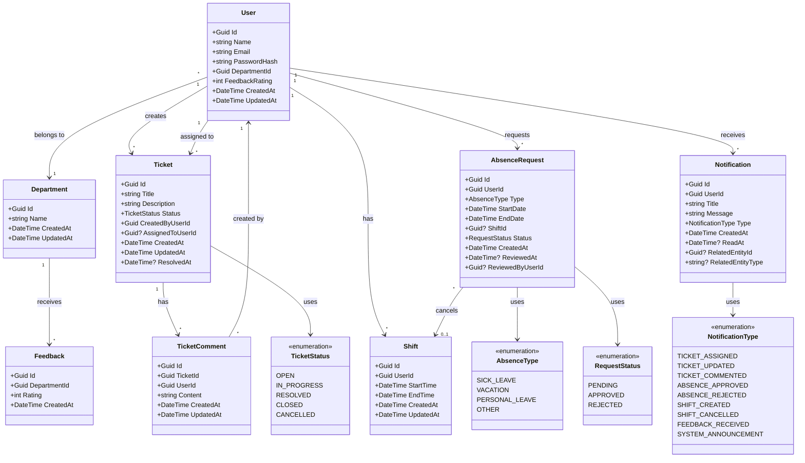

# H4
Template til H4 med Flutter, React Native og C# backend

## YourOffice Domain Model

```mermaid
classDiagram
    class User {
        +Guid Id
        +string Name
        +string Email
        +string PasswordHash
        +Guid DepartmentId
        +int FeedbackRating
        +DateTime CreatedAt
        +DateTime UpdatedAt
    }

    class Department {
        +Guid Id
        +string Name
        +DateTime CreatedAt
        +DateTime UpdatedAt
    }

    class Ticket {
        +Guid Id
        +string Title
        +string Description
        +TicketStatus Status
        +Guid CreatedByUserId
        +Guid? AssignedToUserId
        +DateTime CreatedAt
        +DateTime UpdatedAt
        +DateTime? ResolvedAt
    }

    class TicketStatus {
        <<enumeration>>
        OPEN
        IN_PROGRESS
        RESOLVED
        CLOSED
        CANCELLED
    }

    class Feedback {
        +Guid Id
        +Guid DepartmentId
        +int Rating
        +DateTime CreatedAt
    }

    class Shift {
        +Guid Id
        +Guid UserId
        +DateTime StartTime
        +DateTime EndTime
        +DateTime CreatedAt
        +DateTime UpdatedAt
    }

    class AbsenceRequest {
        +Guid Id
        +Guid UserId
        +AbsenceType Type
        +DateTime StartDate
        +DateTime EndDate
        +Guid? ShiftId
        +RequestStatus Status
        +DateTime CreatedAt
        +DateTime? ReviewedAt
        +Guid? ReviewedByUserId
    }

    class AbsenceType {
        <<enumeration>>
        SICK_LEAVE
        VACATION
        PERSONAL_LEAVE
        OTHER
    }

    class RequestStatus {
        <<enumeration>>
        PENDING
        APPROVED
        REJECTED
    }

    class TicketComment {
        +Guid Id
        +Guid TicketId
        +Guid UserId
        +string Content
        +DateTime CreatedAt
        +DateTime UpdatedAt
    }

    class Notification {
        +Guid Id
        +Guid UserId
        +string Title
        +string Message
        +NotificationType Type
        +DateTime CreatedAt
        +DateTime? ReadAt
        +Guid? RelatedEntityId
        +string? RelatedEntityType
    }

    class NotificationType {
        <<enumeration>>
        TICKET_ASSIGNED
        TICKET_UPDATED
        TICKET_COMMENTED
        ABSENCE_APPROVED
        ABSENCE_REJECTED
        SHIFT_CREATED
        SHIFT_CANCELLED
        FEEDBACK_RECEIVED
        SYSTEM_ANNOUNCEMENT
    }

    User "*" --> "1" Department : belongs to
    User "1" --> "*" Ticket : creates
    User "1" --> "*" Ticket : assigned to
    User "1" --> "*" Shift : has
    User "1" --> "*" AbsenceRequest : requests
    User "1" --> "*" Notification : receives
    Department "1" --> "*" Feedback : receives
    Ticket "1" --> "*" TicketComment : has
    Ticket --> TicketStatus : uses
    TicketComment "*" --> "1" User : created by
    AbsenceRequest --> AbsenceType : uses
    AbsenceRequest --> RequestStatus : uses
    AbsenceRequest "*" --> "0..1" Shift : cancels
    Notification --> NotificationType : uses
```